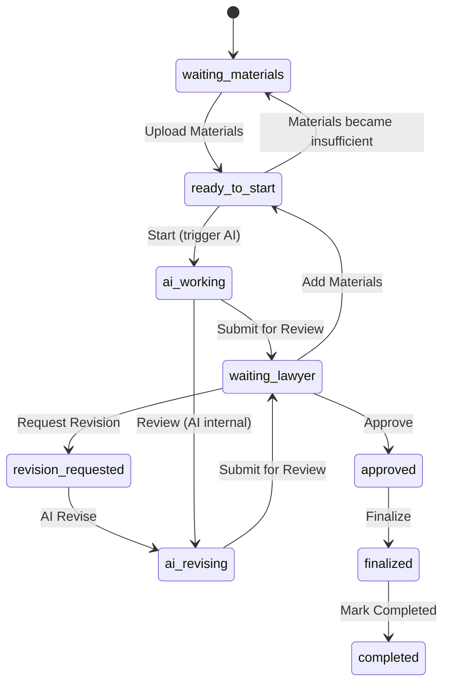

# P2.2 Unified Lifecycle

- Date: 2026-07-10
- Author: LawDesk Team
- Scope: Define a single, consistent lifecycle and state machine for all Work Items inside a Matter. This is a design-only document: no code, schema, table, API, or UI changes.

References:
- P2.1 LawDesk Core Architecture
- M150.1 TodayService Technical Design
- M150.2 Dispatch Engine Technical Design

## 1. 为什么需要统一生命周期

- 一致性：不同 Workspace（证据、文书、检索等）共享同一语义，降低认知成本并便于跨模块自动化/提示。
- 可观测性：统一状态使 `Today`、监控和告警能够准确计算优先级、风险与等待项。
- 可复核性：所有状态与转移规则可记录、可回溯，方便合规与审计。
- 可扩展性：后续引入的规则引擎、建议生成器与 AI 运行时可以基于统一事件模型安全演进。

## 2. 生命周期适用范围

- 适用于 LawDesk 中属于 `Matter` 下的所有 Work Item（包括但不限于：任务 Task、文书 Document 草稿、证据 Evidence 条目、事实 Fact、争议 Issue、论证 Argument、AI-generated drafts）。
- 不直接改变现有数据库 Schema；该生命周期由应用层与 Dispatch/Today 层解读并驱动显示与建议。

## 3. Work Item 标准状态

系统默认的标准状态集合（用于统一显示与计算）：

- `waiting_materials`  — 等待外部/当事人/客户补充材料
- `ready_to_start`   — 律师/团队可开始处理（有足够材料）
- `ai_working`       — AI 正在处理（生成草稿/分析）
- `waiting_lawyer`   — AI 完成或任务等待律师确认/补充
- `revision_requested` — 律师或系统请求修改（需要修订）
- `ai_revising`      — AI 按律师要求进行修订
- `approved`         — 律师审核通过但尚未定稿（审核通过态）
- `finalized`        — 律师定稿（不可再由 AI 自动改写的终点）
- `completed`        — 工作项结束（如上传完毕/提交法院/执行完成）

## 4. 状态说明（简明）

- `waiting_materials`：缺少关键材料或字段，AI 无法安全推进。
- `ready_to_start`：材料齐备，律师或 AI 可发起处理动作。
- `ai_working`：AI 被触发生成草稿/分析结果；此时律师应被视为可被打断的观察者而非提交者。
- `waiting_lawyer`：AI 输出或人类协作后的结果等待律师审阅或补充。
- `revision_requested`：律师显式要求修改（可由律师注释或以工作指令触发）。
- `ai_revising`：AI 根据律师反馈进行第二轮及多轮修订。
- `approved`：律师确认内容实质正确，可以进入定稿流程。
- `finalized`：律师执行定稿动作（生成最终文档版本、签署或提交），为不可自动覆盖的状态。
- `completed`：后续步骤（如提交法院、执行完成、案件相关行动完成）标记为完成，Work Item 生命周期结束。

## 5. 状态流转图

（使用 Mermaid 格式呈现，可在支持渲染的地方查看）

说明：状态图仅呈现主要路径，允许多轮 `revision_requested` <-> `ai_revising` 循环。

## 6. 律师动作（与状态的映射）

- Upload Materials → `waiting_materials` -> `ready_to_start`（当材料满足）
- Start → `ready_to_start` -> `ai_working`（可为律师手动开始或触发 AI）
- Approve → `waiting_lawyer` -> `approved`
- Request Revision → `waiting_lawyer` -> `revision_requested`
- Add Materials → 任意 `waiting_*` -> `ready_to_start`（或触发额外修订）
- Finalize → `approved` -> `finalized`

操作语义要求：所有律师动作需记录审计条目（who/when/why）。

## 7. AI 动作（与状态的映射）

- Process → 触发 `ai_working`（例如运行分析、提取事实）
- Analyze → 在 `ai_working` 阶段对材料做质量判定并产生 `waiting` 原因
- Generate → 生成草稿（`ai_working` -> `waiting_lawyer`）
- Review → 内部校验或生成差异报告（可在 `ai_working` 内部流转）
- Revise → `ai_revising`（回应 `revision_requested`）
- Submit for Review → `ai_working`/`ai_revising` -> `waiting_lawyer`

约束：AI 的动作只修改 Draft/Transient 内容；任何决定性或不可逆的变更须由律师执行（`finalize`）。

## 8. 审核与定稿的区别

- 审核（Approve）是律师确认草稿在法律要点或事实陈述上可以接受，属于“人审”入口，但可能允许随后补充或再次修改。
- 定稿（Finalize）是律师执行的终结动作：生成标记为 `final` 的 Artifact/Document、触发签署/导出或提交流程，并防止后续 AI 自动覆盖。
- 审核可多次发生；定稿应产生明确的审计与版本快照。

## 9. 多轮修改机制

- 支持 N 轮 `revision_requested` ↔ `ai_revising` 循环。
- 每一轮：律师需提供 `revision_instructions` 文本或选择性标注；AI 将返回 `diff` / `change_summary`，并以 `Submit for Review` 进入 `waiting_lawyer`。
- 系统需限制并记录轮次（meta：`revision_round`），以便审计与超时策略（如超过 5 轮人工干预提示负责人）。

## 10. Empty State 规则

- 对于 Work Item 层面：当某状态下无条目，返回稳定结构（空数组、明确 `status` 字段）。
- 对于文书草稿：若草稿 `content` 为空且处于 `waiting_lawyer`，在 `Today` / Workspace 提示具体 `waitingReason`（如 `待律师补全文书内容`）。
- UI 不应展示内部状态枚举名（如 `ai_revising`），而应映射为用户友好短语（如 `AI 正在修订`）。

## 11. Error State 规则

- 定义 `error` 子态用于内部故障：例如 `ai_working.error`、`ai_revising.error`、`finalize.error`。
- 发生错误时：
  - 记录错误代码和简短描述（不泄露堆栈）
  - 将 Work Item 自动回退到安全状态（通常 `waiting_lawyer` 或 `ready_to_start`），并在 `Today` 中作为 `waiting`/`risk` 提示
  - `meta.partial=true` 或在 `Today` 的 `meta.warnings` 中列出受影响项
- 错误需可重试，AI 错误应生成运维工单或告知负责人。

## 12. Today Dashboard 如何读取这些状态

- TodayService / Dispatch Engine 将基于 Work Item 状态映射与规则筛选：
  - `waiting` 分组：包含 `waiting_materials`、`waiting_lawyer`、`revision_requested`（视为需律师介入）
  - `completed` 分组：`finalized`/`completed`（并按时间窗口过滤“今日已完成”）
  - `nextActions`：对 `ready_to_start`、`waiting_materials`、`waiting_lawyer` 等状态基于规则生成建议动作（例如 `开始生成草稿`、`补充证据`）
  - `activeMatters`：若 Matter 下存在 `waiting` 或 `nextActions` 项，则计入活跃列表
- Today 显示语言需为律师可读的短语（映射表由 UI 层负责）；Today 内部使用统一状态枚举进行计算。

## 13. Matter 首页如何读取这些状态

- Matter 首页（Workspace Overview）显示 Matter 级别的摘要：
  - 当前有多少 `waiting`（需律师动作）
  - 当前有哪些 `nextActions`（系统建议）
  - 当前处于哪一阶段（由 Dispatch 的 stageEngine 推断）
- 对于每个 Workspace Tab（证据/文书/检索），该 Tab 将按照统一生命周期对其列项进行分组与过滤（例如只显示 `drafts`、`waiting_lawyer` 的文书）。

## 14. Workspace 如何读取这些状态

- Workspace（单 Matter）是 Work Item 的操作面：
  - 列表视图应支持按照统一状态过滤/搜索（例如：只看 `waiting_lawyer` 的文书）
  - 每个条目应展示 `status`（映射为友好文本）、`revision_round`、`last_updated` 与 `waitingReason`（如有）
  - 操作按钮映射到律师动作（Upload / Start / Approve / Request Revision / Finalize）

## 15. V1 实现边界

- V1 仅实现：
  - 应用层状态映射与显示（UI 映射友好短语）
  - TodayService/DispatchEngine 的只读规则化计算（不写回任何业务对象）
  - AI 仅作为建议与草稿生成者，所有决定仍由律师执行
  - `finalize` 由现有的 Document finalization 路径实现（不新增表/字段）
- V1 不做：
  - 在生命周期层面新增持久化状态表或变更现有 Schema
  - 自动执行跨对象的状态迁移（例如自动把 `approved` 升为 `finalized`）
  - 将 `Today` 变成 Workflow 执行引擎

## 16. V2 扩展方向

- V2 可以考虑（但需逐条审查合规与审计要求）：
  - 将部分生命周期事件作为可配置规则（DSL）驱动、并提供回写接口（受严格限权与审计）
  - 引入工作项模板、SLA 与超时自动提醒
  - 使用 AI 生成建议并在律师授权后批量执行（半自动化流）
  - 引入更丰富的错误/重试策略与运维工作流
  - 增强多方协作（客户外部上传、第三方取证系统接入）

## 17. 与 P2.3 / P2.4 / P2.5 的关系

- P2.3 (`Matter` Workspace UX Spec)
  - 将继承此生命周期并实现 UI 映射、动作按钮与审计展示。
- P2.4 (`AI Runtime Integration & Safety`)
  - 定义 AI 的输入输出契约、错误退化、revision 指令格式与 `revision_round` 语义。
- P2.5 (`Observability & SLA`)（建议）
  - 定义生命周期事件的度量（状态转移时间、平均修订轮次、AI error rate）、报警阈值与仪表盘。

## 18. 验收标准

P2.2 交付验收应满足：

- 文档中包含统一的状态枚举与语义说明（见第 3、4 节）。
- 状态流转图清晰展示主要路径与多轮修订（见第 5 节）。
- 定义律师与 AI 对应动作与权限（见第 6、7 节）。
- 定义 Empty / Error 处理与 Today/Matter/Workspace 的读取方式（见第 10、11、12、13、14 节）。
- 明确 V1 边界与 V2 扩展方向（见第 15、16 节）。
- 给出与 P2.3 / P2.4 / P2.5 的交付关系（见第 17 节）。
- 给出可执行的验收测试用例示例：
  - 场景 A（文书草稿空）：创建文书草稿 -> 状态 `waiting_lawyer` -> Today 显示 `待律师补全文书内容`。
  - 场景 B（AI 修订）：触发 AI 生成草稿 -> `ai_working` -> `waiting_lawyer` -> 律师 request revision -> `revision_requested` -> `ai_revising` -> `waiting_lawyer` -> `approved` -> `finalized`。

---

## Appendix: Minimal UI Mapping (示例)

- `waiting_materials`  -> `等待材料`
- `ready_to_start`    -> `可开始`
- `ai_working`        -> `AI 处理中`
- `waiting_lawyer`    -> `等待律师`
- `revision_requested`-> `要求修改`
- `ai_revising`       -> `AI 修订中`
- `approved`          -> `审核通过`
- `finalized`         -> `已定稿`
- `completed`         -> `已完成`

